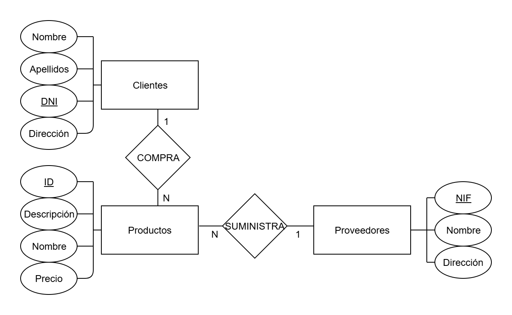

## Descripción del Problema

Te han contratado para diseñar una base de datos para gestionar las ventas de una tienda de deportes. La tienda necesita controlar a los proveedores, clientes y productos. Aquí están los datos específicos que debes manejar:

1. **Clientes**:

    - Nombre
    - Apellidos
    - DNI
    - Dirección

2. **Productos**:

    - Código de identificación
    - Descripción
    - Nombre
    - Precio unitario

3. **Proveedores**:
    - NIF
    - Nombre
    - Dirección

Además, hay algunas reglas de negocio importantes:

-   **Un producto** solo puede ser suministrado por **un proveedor**.
-   Un **proveedor** puede suministrar **varios productos**.
-   Un **cliente** puede comprar **uno o varios productos**.

## Pasos para Crear el Diagrama ER

1. **Identificar las Entidades**:

    - **Clientes**
    - **Productos**
    - **Proveedores**

2. **Definir los Atributos de Cada Entidad**:

    - **Clientes**: Nombre, Apellidos, DNI, Dirección
    - **Productos**: Código de identificación, Descripción, Nombre, Precio unitario
    - **Proveedores**: NIF, Nombre, Dirección

3. **Establecer las Relaciones Entre Entidades**:

    - **Cliente-Producto**: Un cliente puede comprar uno o varios productos.
    - **Producto-Proveedor**: Un producto solo puede ser suministrado por un proveedor, pero un proveedor puede suministrar varios productos.

4. **Definir las Cardinalidades**:
    - **Cliente-Producto**: Relación de uno a muchos (1:N).
    - **Producto-Proveedor**: Relación de muchos a uno (N:1).

## Creación del Diagrama

Vamos a representar esto en un diagrama ER:

-   **Clientes** (rectángulo) con sus atributos (óvalos): Nombre, Apellidos, DNI, Dirección.
-   **Productos** (rectángulo) con sus atributos (óvalos): Código de identificación, Descripción, Nombre, Precio unitario.
-   **Proveedores** (rectángulo) con sus atributos (óvalos): NIF, Nombre, Dirección.
-   Relaciones (rombos):
    -   Relación `COMPRA` entre Clientes y Productos (1 cliente puede comprar varios productos).
    -   Relación `SUMINISTRA` entre Proveedores y Productos (1 proveedor puede suministrar varios productos).

### Diagrama Entidad-Relación Ejemplo

1. **Entidad Cliente**

    - Nombre
    - Apellidos
    - DNI
    - Dirección

2. **Entidad Producto**

    - Código de identificación
    - Descripción
    - Nombre
    - Precio unitario

3. **Entidad Proveedor**

    - NIF
    - Nombre
    - Dirección

4. **Relaciones**
    - **COMPRA** (Cliente-Producto): 1 Cliente compra N Productos
    - **SUMINISTRA** (Proveedor-Producto): N Proveedores suministran 1 Producto

### Visualización



Aquí tienes una visualización simplificada del esquema ER:

```plaintext
      +-----------------+          +-----------------+
      |     Clientes    |          |     Productos   |
      +-----------------+          +-----------------+
      | DNI             |          | Código de ID    |
      | Nombre          |          | Descripción     |
      | Apellidos       |          | Nombre          |
      | Dirección       |          | Precio unitario |
      +-----------------+          +-----------------+
               |                           |
               |                           |
               |                           |
               |    COMPRA         SUMINISTRA
               |                           |
               |                           |
      +-----------------+          +-----------------+
      |    Proveedores  |
      +-----------------+
      | NIF             |
      | Nombre          |
      | Dirección       |
      +-----------------+
```
