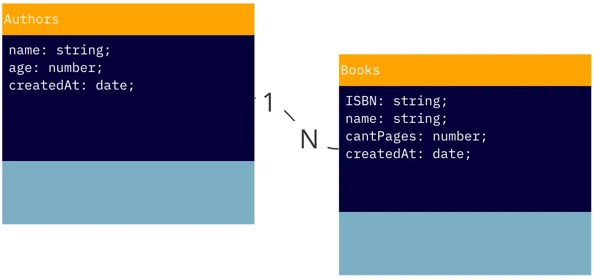

1. Instalación de nuestras dependencias

```
mkdir authors-books
cd authors-books
npm install pg pg-hstore sequelize --save
````

2. Código base inicial

Posterior a nuestras dependencias, crearemos un archivo base llamado index.js

3. Implementando nuestra conexión a PostgreSQL con Sequelize

Para comenzar crearemos un fichero llamado `connection.js` en la raíz de nuestro proyecto para implementar nuestra conexión a PostgreSQL.
Debemos sobreescribir las variables de conexión según las configuraciones locales.

4. Implementando nuestros modelos

La estructura a implementar es la siguiente:



Posterior, crearemos un fichero llamado models.js en la raíz de nuestro proyecto para implementar nuestros modelos.

En este caso serían 2. El modelo de autor y el modelo de libros, en conjunto de sus relaciones 1:N.

Es necesario obtener el objeto de conexión creado previamente. Ya que este objeto es el encargado de crear tablas y sus relaciones.

**NOTA**: Al realizar la conexión con Sequelize e importar nuestros modelos, automáticamente se crearán las tablas en nuestra base de datos.

5. Implementando nuestras funciones y conexión a PostgreSQL

Ahora implementaremos nuestras funciones en el archivo index.js 